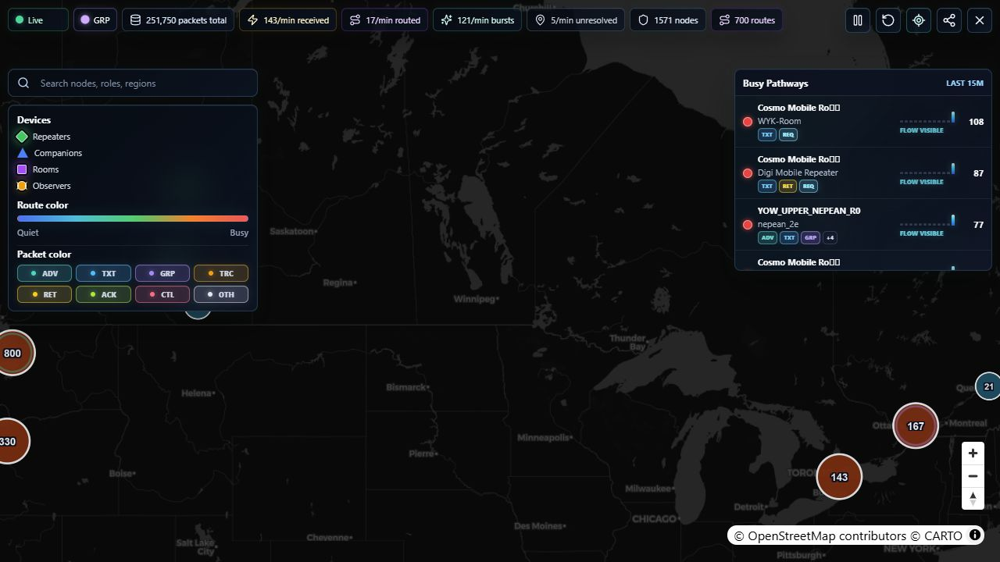
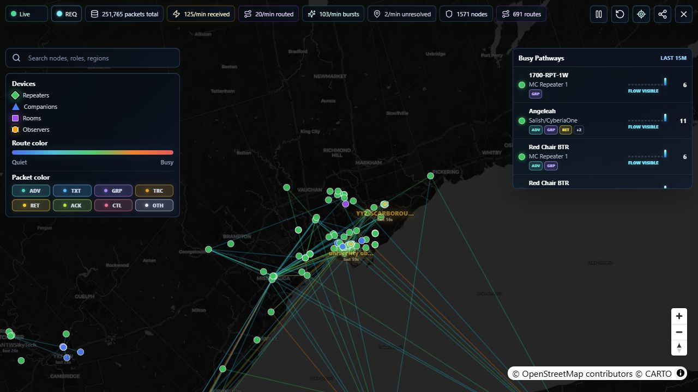
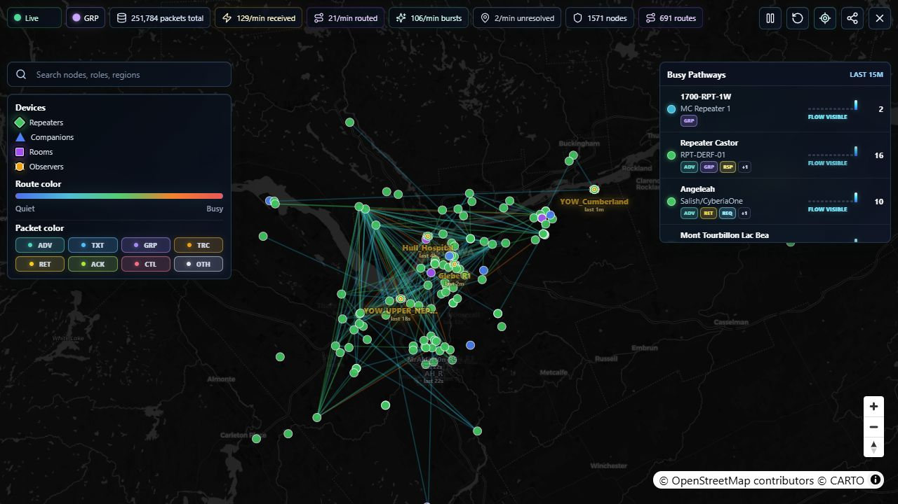

# MeshCore MQTT Live Map v1.1

Also known as **MC-CartoLive**.

MC-CartoLive is a Dockerized live MQTT-to-map dashboard for MeshCore public RF
observations. It ingests MeshCore broker traffic, resolves only
high-confidence RF routes, and serves a smooth public MapLibre dashboard with
live packet motion, observer activity, decoded public message bubbles, and
privacy-safe public APIs.

The app stays intentionally simple for operators: one Go backend, one embedded
React frontend, one SQLite database, one Docker Compose service.

Public Instances: 
Meshcore Canada MQTT - https://routes.canadaverse.org/

## Screenshots

Real public map data from the local production container:







## What It Does

- Subscribes read-only to MeshCore MQTT packet and status topics.
- Decodes MeshCore packet and payload types needed for public map rendering.
- Resolves RF paths conservatively, without drawing guessed routes.
- Shows low-zoom cluster activity and high-zoom route/node detail.
- Animates live packet comets, observer bursts, route payload glows, and message bubbles.
- Includes a compact project bar with MeshCore Canada, GitHub, version, and build links.
- Provides a red Live Follow control for smoothly following areas with fresh packet movement.
- Prioritizes the map on mobile by moving controls to the bottom and hiding secondary panels/toasts.
- Serves public state from a backend memory cache instead of rebuilding every request from SQLite.
- Filters public traffic through the Canada IATA allowlist.
- Keeps private broker credentials, channel secrets, live DB files, packet hashes, public keys, path hex, and resolver debug details out of public responses.

## Architecture

- Go HTTP API, WebSocket server, MQTT subscriber, route resolver, and SQLite persistence.
- React + Vite + TypeScript + MapLibre public dashboard.
- SQLite database at `/app/data/meshcore-live.db`, persisted through Docker volume or bind mount.
- Static frontend embedded into the Go binary during Docker build.

Public routes:

```text
GET /healthz
GET /api/v1/public/state
GET /ws/public
```

With `PUBLIC_MODE=true`, internal debug APIs are not exposed.

## Quick Start

```bash
cp .env.example .env
docker compose up --build
```

Open:

```text
http://localhost:39476
```

The committed example runs a synthetic fixture by default so a fresh clone works
without MQTT credentials. To connect to live MQTT, edit your private `.env`, set
`MQTT_ENABLED=true`, clear `FIXTURE_REPLAY_PATH`, and add your MQTT username and
password.

## Configuration

Real MQTT credentials, channel secrets, private keys, live databases, and local
operator config belong only in your private `.env` and `data/` directory. They
must not be committed.

Important settings:

| Variable | Required | Notes |
| --- | --- | --- |
| `PUBLIC_MODE` | yes | Use `true` for public hosting. |
| `PUBLIC_BASE_URL` | yes | Browser origin allowed for public WebSocket connections. Use your HTTPS site URL in production. |
| `MQTT_ENABLED` | yes | The public example uses `false`; set `true` only with private credentials. |
| `MQTT_BROKER_URL` | yes when MQTT is enabled | Defaults to the MeshCore Canada MQTT broker URL. |
| `MQTT_USERNAME` / `MQTT_PASSWORD` | yes when `MESHCORE_AUTH_MODE=subscriber` and MQTT is enabled | Keep private. |
| `MESHCORE_CHANNEL_SECRETS` | optional | Keep private. Used only to decode sanitized public message bubble text. |
| `PUBLIC_IATAS` | yes | Canada IATA allowlist for public map state/events. |
| `DB_PATH` | yes | SQLite database path inside the container. |
| `CONFIG_YAML` | optional | Private local node/observer coordinate overrides. |
| `FIXTURE_REPLAY_PATH` | optional | Synthetic replay file for demos without MQTT credentials. |

## Credential-Free Demo

The committed `.env.example` already runs with the synthetic fixture:

```text
MQTT_ENABLED=false
FIXTURE_REPLAY_PATH=/app/examples/fixtures/synthetic-live.ndjson
```

Then start Docker:

```bash
docker compose up --build
```

The fixture uses fake public keys and synthetic messages. It is not copied from live traffic.

## Development

Backend:

```bash
cd backend
go test ./...
go run ./cmd/app
```

Frontend:

```bash
cd web
npm ci
npm test -- --run
npm run build
```

Docker:

```bash
docker compose build
```

## Production Hosting

The recommended v1.1 release path is clone + Docker Compose on a VPS or local
host, optionally behind Cloudflare Tunnel or another HTTPS reverse proxy.

For a public site:

1. Set `PUBLIC_MODE=true`.
2. Set `PUBLIC_BASE_URL` to the public HTTPS origin.
3. Keep `.env`, `data/*.db*`, and `data/config.yaml` private.
4. Back up the SQLite database before upgrades.
5. Run `docker compose up -d --build`.

More details:

- [Development](docs/development.md)
- [Production](docs/production.md)
- [Privacy](docs/privacy.md)
- [Security](SECURITY.md)
- [Contributing](CONTRIBUTING.md)
- [Changelog](CHANGELOG.md)

## License

MIT. See [LICENSE](LICENSE).

## Sources

- MeshCore packet format: https://github.com/meshcore-dev/MeshCore/blob/main/docs/packet_format.md
- MeshCore payload format: https://github.com/meshcore-dev/MeshCore/blob/main/docs/payloads.md
- MeshCore Canada MQTT guides: https://meshcore.ca/analyzer/builds/mctomqtt/
- MeshCore MQTT broker subscriber role notes: https://github.com/michaelhart/meshcore-mqtt-broker
